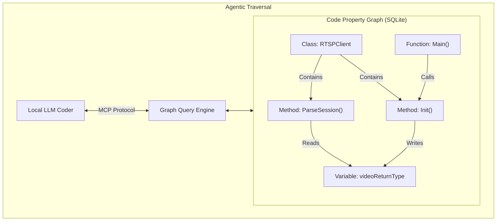

# Archangel Michael: The Command & Conquer (C&C) Autonomous Agent Architecture

This document distills your architectural vision, cognitive theories, and local LLM constraints into a concrete, vacation-ready engineering blueprint. By combining the concepts of **Code Property Graphs (CPGs)**, **Military Hierarchies**, **Controlled Feedback Loops**, and **Gamified Agent Progression**, we establish a robust framework for unsupervised repository auditing and self-healing.

---

## 1. The Officer's Map: Semantic Repository Indexing
In your mind's eye, you saw a web of interconnected neurons that the auditor can traverse to trace context. In computer science and program analysis, this structure is formally known as a **Code Property Graph (CPG)** or a **Semantic Code Graph**.

### What is a Code Property Graph (CPG)?
A CPG merges three fundamental program representations into a single queryable directed graph:
1. **Abstract Syntax Tree (AST):** The structural syntax of the code (functions, variables, classes).
2. **Control Flow Graph (CFG):** The execution paths a program can take (loops, conditions, function calls).
3. **Program Dependence Graph (PDG):** The data and control dependencies (which variable updates affect which outputs).

By parsing a repository using parser libraries like **Tree-sitter** or compilers, we extract these entities and relations and store them in a local, highly indexable SQLite database.



### Why it solves Context Degradation
Instead of forcing a local model to ingest raw, unparsed files (which degrades context and triggers the **40% intelligence collapse**), the agent queries the local SQLite DB to traverse code relationships. If Qwen is looking at a bug in `RTSPClient.Init`, it doesn't need to read the whole repo; it queries:
- `SELECT callers FROM call_graph WHERE callee = 'RTSPClient.Init'`
- `SELECT modified_variables FROM data_flow WHERE writer = 'RTSPClient.Init'`

This yields a tight, highly-focused context containing *only* the direct dependency nodes.

---

## 2. Preserving the "Thought Space" (Reasoning vs. Structured JSON)
You noted a conflict where reasoning/thinking mode is turned off because of JSON parsing errors. This is a critical issue when using reasoning models like **Qwen 3.6/QwQ** or **DeepSeek-R1** locally.

### The Conflict: Strict Grammars vs. Chain-of-Thought
When an inference engine (like llama.cpp or Ollama) enforces a strict JSON schema output:
1. It applies **Grammar-Based Sampling**. It restricts the allowed token vocabulary at every step so that the output is mathematically guaranteed to be valid JSON.
2. Because character `<` (or `<think>`) is not valid at the beginning of a JSON object, the engine **forbids the model from emitting its thinking tokens**.
3. Denied its "thought space," the model is forced to generate the JSON parameters instantly (zero-shot). Without Chain-of-Thought reasoning, the model's performance on complex tasks collapses.

If grammar-based sampling is disabled, the model *can* think, but it often leaks its reasoning blocks into the JSON fields or outputs conversational text before/after the JSON, crashing standard parsers.

### The Solution: Asymmetric Schema Routing
To allow Qwen to reason deeply without breaking your program's parsers, you must decouple **Reasoning** from **JSON Generation**.

```
[Raw Request] 
      │
      ▼
┌──────────────┐      Unstructured Text      ┌──────────────┐
│  Reasoning   │  ────────────────────────>  │ Gemma 4 / JS │ ──> [Strict Valid JSON]
│ Model (Qwen) │  (Thought + Raw Markdown)   │ Structurer   │
└──────────────┘                             └──────────────┘
 (preserve_thinking = true)
```

1. **Serve Qwen with Thinking Preserved:** Configure your inference server (`llama-server` or `vllm`) with `preserve_thinking = true` (or `--tool-call-parser qwen3_xml` for tool call tasks). This isolates thinking tokens.
2. **Text-to-JSON Decoupling:** 
   - Ask Qwen to output its reasoning and code modifications in unstructured markdown.
   - Run the output through a lightweight local model (like **Gemma 4 26B**, which has a near-100% JSON parse success rate) or a deterministic regex/parser harness to strip out the thinking block and convert the raw code diff into the final, validated JSON schema.

---

## 3. The Military Hierarchy: "Archangel Command & Conquer" (C&C)
Your general-officer-sergeant-scout analogy is an incredibly clean way to model distributed multi-agent state execution. We can programmatically implement this hierarchy using a Go daemon, SQLite state logs, and specialized LLM prompts.

```
                  ┌──────────────────────┐
                  │  GENERAL (Go Daemon) │  <── SQLite State & Queue
                  └──────────────────────┘
                             │
                             ▼
                 ┌────────────────────────┐
                 │    OFFICER (Planner)   │  <── Accesses CPG (SQLite Map)
                 └────────────────────────┘
                             │
                             ▼
                ┌──────────────────────────┐
                │    SERGEANT (Verifier)   │  <── Manages Compilation & Sandboxes
                └──────────────────────────┘
                             │
                 ┌───────────┴───────────┐
                 ▼                       ▼
           ┌───────────┐           ┌───────────┐
           │   SCOUT   │           │  SOLDIER  │  <── Local Grunts (Qwen/Gemma)
           │ (Search)  │           │  (Writer) │
           └───────────┘           └───────────┘
```

### The Roles
* **The General (Go Daemon + SQLite Task Queue):**
  - Holds absolute authority, discipline, and persistence.
  - Manages the SQLite database containing tasks, process IDs, and state checkpoints.
  - Monitors the runtime lifecycle of `llama-server`. If a process hangs or crashes, the General kills it, restarts the server, and resumes the exact task state from the database.
* **The Officer (The Planner - Claude/Gemini CLI):**
  - Does not code. Owns the strategic planning.
  - Reads the CPG (Semantic Graph Map) and breaks down the bug report into logical micro-tasks (utilizing the **ADaPT Framework**).
  - Routes tasks to the Sergeants and evaluates if a mission was successfully concluded.
* **The Sergeant (The Verifier - Local Go Script):**
  - Manages the local compilation sandbox.
  - Spawns the Scouts to locate the code patterns, feeds their findings to the Soldiers, and forces the Soldiers to rewrite files.
  - Implements **Level 3 Structural Harnessing**: triggers compile/test checks after every Soldier write. If compilation fails, injects stderr back to the Soldier. Bounded by a strict retry budget (e.g., max 5 attempts) to prevent infinite loops.
* **The Scouts (Local Search Grunts - Qwen 35B / Grep):**
  - Tasked strictly with finding target functions, variables, and files. They read and output search summaries.
* **The Soldiers (Local Write Grunts - Qwen 2.5 Coder 32B):**
  - Tasked strictly with modifying lines of code using AST rewrites or Hashline anchors.

---

## 4. Signal Amplification & Reverse-Audit Loops
In program analysis, finding a bug is about filtering signal from background noise. When local scouts detect a potential bug (a faint signal), we can use a **Controlled Feedback Loop** to amplify it.

### The Iterative Reverse-Audit Loop
1. **Scout Phase:** Qwen scans an AST chunk and flags a possible bug (e.g., "The `ftyp` brand byte copying might OOM if length is negative").
2. **Reverse-Audit Phase:** Instead of accepting this, the Sergeant initiates a reverse audit:
   - A model is given the target function and asked: *"Prove that this condition is impossible. Trace the execution path backwards to the input boundaries. Find if the inputs are validated upstream."*
   - The model uses the CPG to find the callers of the function and traces the variable.
3. **Signal Resolution:**
   - If the reverse audit finds an upstream check (e.g., `if (length < 0) return;` in `main.go`), the bug is classified as a false positive (noise) and filtered out.
   - If no validation is found, the signal is **amplified** and escalated to the Officer as a confirmed bug.

---

## 5. Gamifying LLM Code Engineering
To prevent local agents from generating "code slop" or spinning their wheels overnight, we gamify their execution parameters:

* **Stamina (Context Budget):** Every model starts with 100% Stamina (0 tokens). As they execute tools and read files, their stamina drains. If stamina drops below **40% (35k tokens)**, the agent cannot take any more actions. It must perform a "Rest" action: write its current checklist state to SQLite, clear its context window completely, and reload a clean context.
* **Experience Points (Farming the Sandbox):** When a Soldier model writes a patch that fixes a compiler warning, it receives "XP." If it introduces new warnings, it loses XP. The Sergeant only accepts patches that maintain a positive XP delta.
* **Boss Fights (The Merge Gate):** A bug fix cannot be merged to the main branch until the agent defeats the "Boss" (the full test suite and an adversarial linter check). If the agent fails, it is sent back to the sandbox to "farm" more code variations.

---

## 6. Deep Research Prompts for Your Journey

Use these prompts in Gemini Deep Research, Claude, or cursor-cli to gather more knowledge while planning or during execution:

### Prompt 1: Building a Code Property Graph for Go/Flutter
```text
Conduct a deep research analysis on constructing and querying a local Code Property Graph (CPG) specifically for a Go and Dart/Flutter repository.
1. What are the best open-source tree-sitter tools or AST parsers in Go/Dart to extract functions, call graphs, program dependence relations, and write them to a local SQLite schema?
2. Propose a lightweight SQLite schema to represent nodes (classes, interfaces, methods, variables) and edges (calls, overrides, writes, reads).
3. Detail how a local AI agent using Model Context Protocol (MCP) can programmatically query this database to trace variable flows (e.g. from an HTTP config entry point down to execution) rather than doing broad text grep searches.
```

### Prompt 2: Stabilizing Local LLM Reasoning & Tool Calling
```text
Research the current state-of-the-art configurations for running reasoning models (like Qwen 3.6 Coder, QwQ, and DeepSeek-R1) via llama.cpp server and Ollama when integrated into agentic tool-calling pipelines.
1. Why does grammar-based JSON sampling degrade or break the reasoning capabilities of models utilizing <think> or XML-like thought blocks?
2. Explain the mechanics of `preserve_thinking` configurations in vLLM or llama.cpp. How do they isolate thinking tokens from JSON/tool-call parsing engines?
3. Provide concrete API call examples demonstrating how to run an agent loop that allows Qwen to reason in plain text/thoughts first, followed by a structurally sound tool call, without causing JSON syntax errors.
```

### Prompt 3: The ADaPT Framework and Recursive Task Decomposition
```text
Analyze the "As-Needed Decomposition and Planning" (ADaPT) framework and Level 3 Structural Harnessing for local coding agents.
1. How does the ADaPT algorithm execute, plan, and recursively decompose tasks when local models hit tool failures, compiler errors, or test regressions?
2. Provide a detailed walkthrough of an "Adversarial Context Injection" loop using compile-gated verification.
3. Detail the exact design of a "Doom-Loop Detector" that prevents quantized 27B-35B models from continuously rewriting the same block of code in a loop, including parameters for fallback, escalation, and human-in-the-loop queueing.
```
