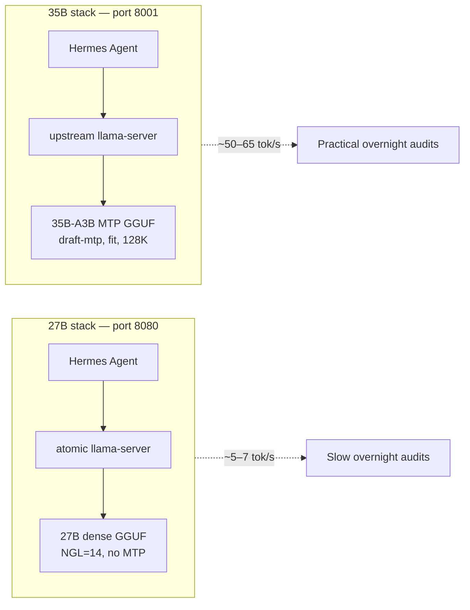

# How we got ~10× decode speed with a *bigger* model

A practical tutorial for **Archangel Michael** (Hermes overnight audits): moving from **Qwen3.6 27B** on a partial-GPU stack to **Qwen3.6 35B-A3B MoE + MTP** on 12 GB VRAM—and ending up with **~50–65 tok/s** instead of **~5–7 tok/s**.

This is not magic. It is three ideas stacked together: **the right model shape**, **the right GGUF**, and **the right llama.cpp flags**.

---

## The paradox in one sentence

We stopped asking a **27B dense model on half the GPU** to generate one token at a time, and started asking a **35B MoE model with a built-in draft head** to verify **two tokens per forward pass**—on **upstream llama.cpp** with **128K context** and **tight VRAM budgeting**.

Bigger on paper. Faster in practice.

---

## Before vs after (this machine)

| | **Old default** (`llama-qwen-27b-stable`) | **New stack** (`llama-qwen-35b-mtp`) |
|---|-------------------------------------------|--------------------------------------|
| Model | Qwen3.6 **27B dense** Q4_K_M | Qwen3.6 **35B-A3B MoE** MTP Q4_K_XL (~22 GB file) |
| Active params / token | ~27B | ~**3B** (MoE routing) |
| llama.cpp | `atomic-llama-cpp-turboquant` | **Upstream** `ggml-org/llama.cpp` |
| Speculative decode | None (baseline) | **`--spec-type draft-mtp`** |
| GPU layers | **14 / 65** (`-ngl 14`) — most layers on CPU | **`--fit`** auto-balances GPU/CPU + reserves headroom |
| KV cache | f16 | **q8_0** (main + draft) |
| Context | 32K | **128K** (`-c 131072`) |
| Port | 8080 | **8001** |
| Typical decode | **~5–7 tok/s** | **~52–64 tok/s** (bench) |
| Speedup | 1× | **~8–12×** |

Measured on **RTX 4070 12 GB**, display on dGPU, i7-13700KF:

```text
# Quick bench (this repo)
./scripts/bench_decode_35b.sh
  → eval: ~52 tok/s, draft acceptance ~80%

# Reddit-style suite (9 prompts × 192 tokens)
./scripts/bench-mtp-reddit.sh
  → ~56–64 tok/s per task, ~79% aggregate acceptance
```

Reference thread (similar hardware, slightly higher numbers with monitor on iGPU):  
[r/LocalLLaMA — 80 tok/s, 128K, 12GB, Qwen3.6 35B + draft-mtp](https://www.reddit.com/r/LocalLLaMA/comments/1t82zxv/80_toksec_and_128k_context_on_12gb_vram_with/)

---

## What actually changed (the “black magic” unpacked)

### 1. Multi-Token Prediction (MTP) — not a separate tiny model

Classic speculative decoding: a **small draft model** guesses tokens; the **big model** accepts or rejects them.

**MTP** is different: Qwen3.6 was **trained** with auxiliary heads that propose draft tokens from the **same** weights. The GGUF must be an **MTP build** (main + head in one file):

- [havenoammo/Qwen3.6-35B-A3B-MTP-GGUF](https://huggingface.co/havenoammo/Qwen3.6-35B-A3B-MTP-GGUF) — what we use
- [unsloth/Qwen3.6-35B-A3B-MTP-GGUF](https://huggingface.co/unsloth/Qwen3.6-35B-A3B-MTP-GGUF) — alternate profile

Plain `Qwen3.6-35B` quants **without** MTP in the name will **not** speed up with `--spec-type draft-mtp`.

Enable in llama.cpp (May 2026+ upstream):

```bash
--spec-type draft-mtp
--spec-draft-n-max 2
```

When acceptance is ~80%, you often get **~1.5–2×** effective throughput per accepted draft round—and with 2 drafts, sometimes **2×+** vs greedy one-token steps.

### 2. MoE: “35B” is not 35B per token

**35B-A3B** is a **Mixture-of-Experts** model: total capacity is large, but each forward pass only activates on the order of **~3B** parameters.

So the “bigger model” is misleading for **speed**: you get **more capability** without paying **dense-35B** cost every token—*if* routing + memory fit stay healthy.

### 3. Two different llama.cpp builds (this matters)

| Build | Path | Used for |
|-------|------|----------|
| **atomic-llama-cpp-turboquant** | `~/git/atomic-llama-cpp-turboquant` | 27B profiles, NextN (`--spec-type nextn`), turboquant KV |
| **upstream llama.cpp** | `~/git/llama-cpp-upstream` | **35B `draft-mtp` only** |

`draft-mtp` landed in **upstream** llama.cpp (~May 2026). Our atomic fork has **NextN** for 27B, not the same code path as upstream **`draft-mtp`** for Qwen3.6 35B MTP GGUFs.

**Do not** point the 35B MTP GGUF at the atomic server and expect the Reddit numbers.

### 4. `-fitt 1536` — VRAM headroom is a speed knob

On 12 GB, the model does **not** fit entirely on GPU. llama.cpp splits layers between GPU and CPU. You also need room for:

- MTP draft KV (`-ctkd` / `-ctvd`)
- Main KV at 128K (`-ctk` / `-ctv`)
- CUDA graphs, activations, desktop compositor

```bash
-fit on
-fitt 1536    # MiB free VRAM to *target* after fit (Reddit: 1536; we often use 2048 with monitor on dGPU)
-fitc 4096    # minimum context if fit must shrink
```

**`-fitt`** tells the fitter: “leave this much GPU memory free.” Too low → OOM or churn. Too high → too many layers on CPU → slow. **1536–2048** is the sweet spot on RTX 4070 with a desktop on the same card.

### 5. q8_0 KV cache — buy context and draft headroom

```bash
-ctk q8_0 -ctv q8_0
-ctkd q8_0 -ctvd q8_0
```

Halving KV precision (vs f16) saves gigabytes at 128K context. That VRAM goes back to **more layers on GPU** and **stable MTP**—often a net win in **tok/s**, not just “fitting.”

### 6. `--spec-draft-n-max 2` — more drafts ≠ faster

On 12 GB MoE, **`2`** is the trade-off point:

| `spec-draft-n-max` | Typical effect on 4070 |
|--------------------|-------------------------|
| 2 | ~**80%** acceptance, best tok/s |
| 3–4 | Higher draft count, **lower** acceptance, **more** wasted forwards |
| 6 | Unsloth lab setting for **large** GPUs—not 12 GB MoE |

Extra rejected drafts are pure overhead.

### 7. 128K context without throwing away the GPU

```bash
-c 131072
-ctxcp 32          # context checkpoints (profile may use 32 vs Reddit’s 64)
--cache-ram 0      # disable prompt RAM cache — saves ~1 GB on 12 GB cards
```

Audits need **long** tool loops (64K+). The old 27B profile capped at **32K** and hit `exceed_context_size` on large repos. The 35B profile runs **128K** with Hermes compression above ~85% fill.

### 8. Other flags (stability + throughput)

From `scripts/serve-qwen35-draft-mtp.sh`:

```bash
-fa on              # flash attention
--no-mmap           # predictable RAM/VRAM (Reddit + our defaults)
--no-warmup         # faster “API ready” for automation
-np 1               # one slot — audits are sequential
-b 1024 -ub 512     # batch / micro-batch
-t 10 -tb 12        # CPU threads for offloaded layers
```

Sampling for **agentic audits** (Unsloth “precise coding” + thinking):

```bash
--temp 0.6 --top-p 0.95 --top-k 20
--chat-template-kwargs '{"preserve_thinking": true}'
```

---

## Architecture (two servers, one workflow)



Profiles are **separate**. Starting 35B on **8001** does not stop 27B on **8080**.

---

## Reproduce from zero

All paths assume repo root:

```bash
cd /home/ivan/git/archangel-michael
```

### Step 1 — Build upstream llama.cpp (CUDA, sm_89 for RTX 4070)

```bash
./scripts/setup-upstream-llama-mtp.sh
```

Installs to `~/git/llama-cpp-upstream/build/bin/llama-server`. Verify:

```bash
~/git/llama-cpp-upstream/build/bin/llama-server --help 2>&1 | grep draft-mtp
```

### Step 2 — Download MTP GGUF (~22 GB)

```bash
./scripts/download-qwen35-mtp-gguf.sh
# → /home/ivan/models/Qwen3.6-35B-A3B-MTP/Qwen3.6-35B-A3B-MTP-UD-Q4_K_XL.gguf
```

Optional faster Hub download:

```bash
export HF_XET_HIGH_PERFORMANCE=1
# HF_TOKEN=...  # optional, for rate limits
```

### Step 3 — Preflight

```bash
./scripts/preflight-qwen35-mtp.sh
```

### Step 4 — Free VRAM, start server

```bash
./start_llama.sh llama-qwen-27b-stable --stop   # if 8080 was up
pkill ollama || true                              # optional

./start_llama.sh llama-qwen-35b-mtp               # port 8001, wait for API ready
```

### Step 5 — Benchmark

```bash
./scripts/bench_decode_35b.sh
./scripts/bench-mtp-reddit.sh
```

`bench-mtp-reddit.sh` calls the native endpoint `http://127.0.0.1:8001/completion` (not OpenAI `/v1`).

### Step 6 — Run audits on the fast stack

```bash
./scripts/apply_profile.sh llama-qwen-35b-mtp
./run_audits.sh --profile llama-qwen-35b-mtp --task 1
```

Marathon (VideoBytes packages):

```bash
./scripts/run_videobytes_marathon.sh --continue-on-error
```

---

## The exact server recipe (reference)

Implemented in [`scripts/serve-qwen35-draft-mtp.sh`](../../scripts/serve-qwen35-draft-mtp.sh), profile [`profiles/llama-qwen-35b-mtp.conf`](../../profiles/llama-qwen-35b-mtp.conf):

```bash
llama-server \
  -m /home/ivan/models/Qwen3.6-35B-A3B-MTP/Qwen3.6-35B-A3B-MTP-UD-Q4_K_XL.gguf \
  -fit on -fitt 2048 -fitc 4096 \
  -c 131072 -n 32768 \
  -fa on -np 1 \
  -ctk q8_0 -ctv q8_0 -ctkd q8_0 -ctvd q8_0 \
  -ctxcp 32 \
  --no-mmap --no-warmup \
  --cache-ram 0 \
  --spec-type draft-mtp \
  --spec-draft-n-max 2 \
  --chat-template-kwargs '{"preserve_thinking": true}' \
  --temp 0.6 --top-p 0.95 --top-k 20 \
  --host 127.0.0.1 --port 8001
```

(`-fitt` is **2048** in the profile when the monitor uses the dGPU; Reddit used **1536** with display on iGPU.)

---

## Why the old 27B setup was slow (checklist)

1. **`NGL=14`** — majority of layers on **CPU**; decode is memory-bandwidth bound on CPU RAM.
2. **No speculative decode** — one token per full forward pass.
3. **Wrong fork for MTP** — 27B MTP file supports **NextN** on atomic, not **draft-mtp** on upstream.
4. **32K context ceiling** — large audits re-process prompts or fail with 400s.
5. **VRAM contention** — Ollama, desktop, and llama-server fighting for 12 GB (see early `backend.log` OOM at `ngl 18` with only **389 MiB** free).

None of that is “Hermes is slow.” It was **inference configuration**.

---

## Tuning ladder (when something breaks)

| Symptom | Try |
|---------|-----|
| OOM at load | `FIT_TARGET=2048`, `pkill ollama`, stop 8080 server |
| Still OOM | `MAIN_GGUF_ALT` (Q3_K_XL) in profile, or `CTX=98304` |
| Low tok/s, OK acceptance | Plug monitor into **iGPU**; free dGPU VRAM |
| Low acceptance (&lt;70%) | Lower `SPEC_DRAFT_N_MAX` to **2** (not up) |
| `draft-mtp` missing | Rebuild upstream: `./scripts/setup-upstream-llama-mtp.sh` |
| Bench 404 | Use `bench-mtp-reddit.sh` (native `/completion`), not `/v1` for that script |

---

## Mental model for the next time someone says “use a smaller model”

On a **12 GB** card, **smaller dense + partial GPU** is often the worst of both worlds.

Better recipe:

1. **MoE** if you need quality at manageable active width.  
2. **MTP GGUF** + **`draft-mtp`** if you need decode throughput.  
3. **`--fit` + q8_0 KV + draft-n-max 2** if you need **long context** on the same card.  
4. **Upstream llama.cpp** for the feature—not every fork ships the same speculative paths.

That combination is what turned “overnight” from “maybe two tasks” into “actually finish the marathon.”

---

## Further reading

- [docs/guides/qwen36-unsloth-mtp.md](../guides/qwen36-unsloth-mtp.md) — Unsloth sampling, draft depth, Ollama warning  
- [README.md](../../README.md) — profiles, ports, VideoBytes marathon  
- [llama.cpp PR #22673 — MTP support](https://github.com/ggml-org/llama.cpp/pull/22673)  
- [carteakey — Running Qwen3.6-35B-A3B MTP on 12GB](https://carteakey.dev/blog/running-qwen3-6-mtp-locally/)
